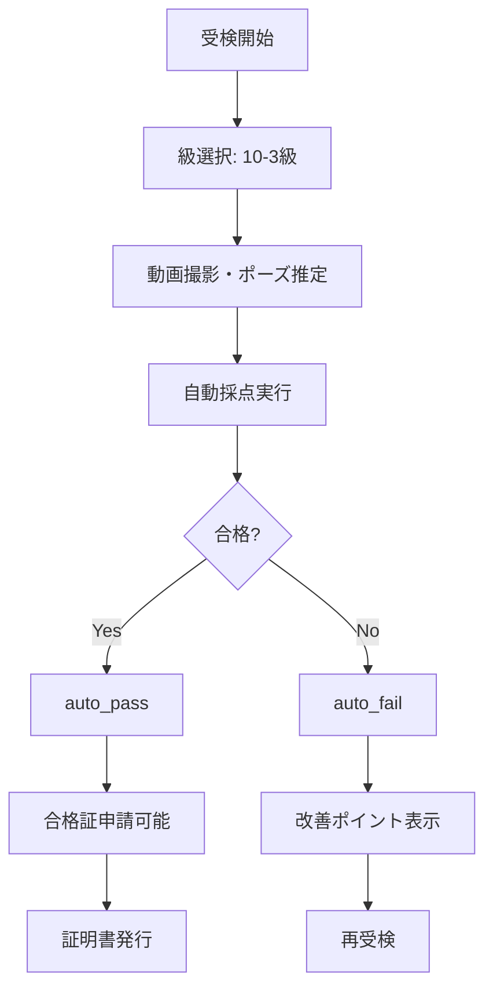
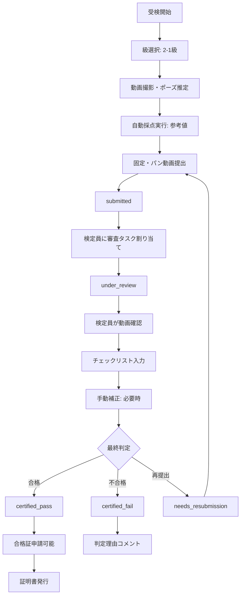

# 二層判定モデル - 設計ドキュメント

**作成日**: 2026-02-12  
**バージョン**: 1.0  
**ステータス**: Phase A〜C 完了、Phase D〜E 部分実装

---

## 📋 目次

1. [概要](#概要)
2. [判定モデル](#判定モデル)
3. [データベース設計](#データベース設計)
4. [フロー設計](#フロー設計)
5. [UI設計](#ui設計)
6. [実装状況](#実装状況)
7. [テスト](#テスト)
8. [未解決課題](#未解決課題)

---

## 概要

### 目的

ランニング技能検定に二層判定モデルを導入し、級別に異なる判定方式を適用する。

- **10級〜3級**: 自動採点による即時合否判定（AUTO_FINAL）
- **2級・1級**: 検定員による動画審査が必須（REVIEW_REQUIRED）

### 前提条件

- 既存のスプリント分析機能は削除せず、差分追加のみで実装
- 既存DBテーブルは拡張のみ、破壊的変更なし
- ロールバックSQL完備

---

## 判定モデル

### 判定モード分岐

```typescript
function determineJudgmentMode(gradeCode: GradeCode): JudgmentMode {
  const gradeNumber = gradeCodeToNumber(gradeCode);
  return gradeNumber <= 2 ? 'REVIEW_REQUIRED' : 'AUTO_FINAL';
}
```

### ステータス遷移

#### AUTO_FINAL（10級〜3級）

```
draft → auto_pass (合格時)
      → auto_fail (不合格時)
```

#### REVIEW_REQUIRED（2級・1級）

```
draft → submitted → under_review → certified_pass (合格時)
                                 → certified_fail (不合格時)
                                 → needs_resubmission (再提出要求時)
```

### 合格基準

| 級 | 合格基準点 | 判定モード |
|----|-----------|-----------|
| 1級 | 80点以上 | REVIEW_REQUIRED |
| 2級 | 80点以上 | REVIEW_REQUIRED |
| 3級 | 70点以上 | AUTO_FINAL |
| 4級〜10級 | 70点以上 | AUTO_FINAL |

---

## データベース設計

### 新規テーブル

#### 1. review_tasks（審査タスク管理）

```sql
CREATE TABLE review_tasks (
  id UUID PRIMARY KEY,
  attempt_id UUID NOT NULL REFERENCES certification_attempts(id),
  reviewer_id UUID REFERENCES auth.users(id),
  assigned_at TIMESTAMPTZ,
  status VARCHAR(50) CHECK (status IN ('pending', 'in_progress', 'completed', 'cancelled')),
  priority INTEGER CHECK (priority BETWEEN 1 AND 10),
  due_date TIMESTAMPTZ,
  notes TEXT,
  created_at TIMESTAMPTZ NOT NULL DEFAULT now(),
  updated_at TIMESTAMPTZ NOT NULL DEFAULT now()
);
```

#### 2. review_checklists（審査チェックリスト）

```sql
CREATE TABLE review_checklists (
  id UUID PRIMARY KEY,
  attempt_id UUID NOT NULL REFERENCES certification_attempts(id),
  reviewer_id UUID NOT NULL REFERENCES auth.users(id),
  
  -- チェック項目
  posture_alignment BOOLEAN,
  knee_angle_appropriate BOOLEAN,
  stride_consistency BOOLEAN,
  ground_contact_efficiency BOOLEAN,
  arm_swing_coordination BOOLEAN,
  hfvp_linearity BOOLEAN,              -- 1級のみ
  hfvp_r2_acceptable BOOLEAN,          -- 1級のみ
  
  overall_technique_score INTEGER CHECK (overall_technique_score BETWEEN 0 AND 100),
  video_quality_acceptable BOOLEAN NOT NULL DEFAULT true,
  
  -- 手動補正
  manual_angle_correction DECIMAL(5, 2),
  manual_stride_correction DECIMAL(5, 2),
  manual_contact_correction DECIMAL(5, 2),
  manual_hfvp_correction DECIMAL(5, 2),
  
  -- 判定
  decision VARCHAR(50) CHECK (decision IN ('pass', 'fail', 'resubmit')),
  decision_reason TEXT NOT NULL CHECK (char_length(decision_reason) >= 10),
  additional_comments TEXT,
  
  submitted_at TIMESTAMPTZ NOT NULL DEFAULT now(),
  decided_at TIMESTAMPTZ NOT NULL DEFAULT now()
);
```

#### 3. certificate_applications（合格証申請）

```sql
CREATE TABLE certificate_applications (
  id UUID PRIMARY KEY,
  attempt_id UUID NOT NULL REFERENCES certification_attempts(id),
  user_id UUID NOT NULL REFERENCES auth.users(id),
  
  full_name VARCHAR(100) NOT NULL,
  display_name VARCHAR(100) NOT NULL,
  birth_date DATE NOT NULL,
  affiliation VARCHAR(200),
  email VARCHAR(255) NOT NULL,
  phone VARCHAR(50),
  postal_code VARCHAR(20),
  address TEXT,
  
  application_id VARCHAR(50) UNIQUE,    -- 例: JRPO-2026-001234
  grade_code VARCHAR(10) NOT NULL,
  status VARCHAR(50) CHECK (status IN ('not_applied', 'applied', 'issued', 'rejected')),
  
  certificate_number VARCHAR(50) UNIQUE,
  certificate_url TEXT,
  issued_at TIMESTAMPTZ,
  expires_at TIMESTAMPTZ,
  
  applied_at TIMESTAMPTZ NOT NULL DEFAULT now(),
  created_at TIMESTAMPTZ NOT NULL DEFAULT now(),
  updated_at TIMESTAMPTZ NOT NULL DEFAULT now()
);
```

### 既存テーブル拡張

#### certification_attempts

新規カラム追加:

```sql
ALTER TABLE certification_attempts 
  ADD COLUMN status attempt_status_enum NOT NULL DEFAULT 'draft',
  ADD COLUMN judgment_mode judgment_mode_enum,
  ADD COLUMN grade_code VARCHAR(10),
  ADD COLUMN fixed_video_url TEXT,
  ADD COLUMN panning_video_url TEXT,
  ADD COLUMN submitted_at TIMESTAMPTZ,
  ADD COLUMN reviewed_at TIMESTAMPTZ,
  ADD COLUMN reviewer_id UUID REFERENCES auth.users(id);
```

#### certification_results

新規カラム追加:

```sql
ALTER TABLE certification_results 
  ADD COLUMN decision_type VARCHAR(50) CHECK (decision_type IN ('auto', 'manual', 'mixed')),
  ADD COLUMN decided_by UUID REFERENCES auth.users(id),
  ADD COLUMN decision_reason TEXT;
```

#### certification_audit_logs

event_type制約拡張:

```sql
ALTER TABLE certification_audit_logs ADD CONSTRAINT chk_event_type CHECK (
  event_type IN (
    -- 既存イベント
    'session_started', 'session_completed', 'session_cancelled',
    'attempt_started', 'attempt_completed', 'score_calculated',
    'manual_correction_applied', 'result_issued', 'certificate_generated',
    'rule_updated', 'manual_override',
    -- 新規イベント（二層判定用）
    'attempt_submitted', 'review_assigned', 'review_started', 'review_completed',
    'certificate_applied', 'certificate_issued', 'certificate_rejected',
    'video_uploaded', 'status_changed'
  )
);
```

### ビュー

#### review_pending_list（検定員向け審査待ちリスト）

```sql
CREATE VIEW review_pending_list AS
SELECT 
  rt.id AS task_id,
  rt.reviewer_id,
  rt.assigned_at,
  rt.due_date,
  rt.priority,
  ca.id AS attempt_id,
  ca.grade_code,
  ca.status,
  ca.submitted_at,
  ca.fixed_video_url,
  ca.panning_video_url,
  u.email AS candidate_email
FROM review_tasks rt
INNER JOIN certification_attempts ca ON rt.attempt_id = ca.id
LEFT JOIN auth.users u ON ca.user_id = u.id
WHERE rt.status IN ('pending', 'in_progress')
  AND ca.status = 'under_review'
ORDER BY rt.priority ASC, rt.assigned_at ASC;
```

#### certificate_issuance_summary（管理者向け証明書発行サマリー）

```sql
CREATE VIEW certificate_issuance_summary AS
SELECT 
  app.grade_code,
  COUNT(*) AS total_applications,
  SUM(CASE WHEN app.status = 'applied' THEN 1 ELSE 0 END) AS pending_count,
  SUM(CASE WHEN app.status = 'issued' THEN 1 ELSE 0 END) AS issued_count,
  SUM(CASE WHEN app.status = 'rejected' THEN 1 ELSE 0 END) AS rejected_count,
  AVG(EXTRACT(EPOCH FROM (app.issued_at - app.applied_at)) / 3600)::INTEGER AS avg_processing_hours
FROM certificate_applications app
WHERE app.status != 'not_applied'
GROUP BY app.grade_code;
```

### Row Level Security（RLS）

#### 受検者ポリシー

```sql
-- 自分の試行のみ閲覧可能
CREATE POLICY examinee_view_own_attempt_status ON certification_attempts
FOR SELECT USING (auth.uid() = user_id);

-- draft ステータスの試行のみ更新可能
CREATE POLICY examinee_update_draft_attempts ON certification_attempts
FOR UPDATE USING (auth.uid() = user_id AND status = 'draft');

-- 合格者のみ証明書申請可能
CREATE POLICY examinee_apply_certificate ON certificate_applications
FOR INSERT WITH CHECK (
  auth.uid() = user_id 
  AND EXISTS (
    SELECT 1 FROM certification_attempts ca
    WHERE ca.id = attempt_id 
      AND ca.user_id = auth.uid()
      AND ca.status IN ('auto_pass', 'certified_pass')
  )
);

-- 自分の申請のみ閲覧可能
CREATE POLICY examinee_view_own_applications ON certificate_applications
FOR SELECT USING (auth.uid() = user_id);
```

#### 検定員ポリシー

```sql
-- 割り当てられたタスクのみ閲覧可能
CREATE POLICY reviewer_view_assigned_tasks ON review_tasks
FOR SELECT USING (auth.uid() = reviewer_id);

-- 審査中の試行を閲覧可能
CREATE POLICY reviewer_view_review_attempts ON certification_attempts
FOR SELECT USING (
  status = 'under_review' 
  AND EXISTS (
    SELECT 1 FROM review_tasks rt
    WHERE rt.attempt_id = certification_attempts.id
      AND rt.reviewer_id = auth.uid()
  )
);

-- 審査中の試行を更新可能
CREATE POLICY reviewer_update_review_attempts ON certification_attempts
FOR UPDATE USING (
  status = 'under_review' 
  AND EXISTS (
    SELECT 1 FROM review_tasks rt
    WHERE rt.attempt_id = certification_attempts.id
      AND rt.reviewer_id = auth.uid()
  )
);

-- チェックリスト提出可能
CREATE POLICY reviewer_submit_checklist ON review_checklists
FOR INSERT WITH CHECK (
  auth.uid() = reviewer_id
  AND EXISTS (
    SELECT 1 FROM review_tasks rt
    WHERE rt.attempt_id = review_checklists.attempt_id
      AND rt.reviewer_id = auth.uid()
  )
);

-- 自分が作成したチェックリストを閲覧可能
CREATE POLICY reviewer_view_own_checklists ON review_checklists
FOR SELECT USING (auth.uid() = reviewer_id);
```

---

## フロー設計

### 10級〜3級フロー（AUTO_FINAL）



### 2級・1級フロー（REVIEW_REQUIRED）



---

## UI設計

### コンポーネント構成

```
src/components/Certification/
├── CertificationMode.tsx          # メインコンポーネント（級別分岐）
├── AutoJudgment.tsx              # 10-3級：自動判定結果表示
├── ReviewRequired.tsx            # 2-1級：動画提出・審査待ち表示
├── CertificateApplication.tsx    # 合格証申請フォーム
├── ReviewDashboard.tsx           # 検定員：審査待ちリスト（未実装）
└── ReviewDetail.tsx              # 検定員：審査詳細画面（未実装）
```

### AutoJudgment.tsx（10-3級）

**表示内容**:
- 合否バッジ（合格/不合格）
- 品質グレード（良/可/参考）
- 総合得点（70点満点）
- 項目別得点表（角度/ストライド/接地時間/テクニック）
- 改善ポイント（不合格時）
- 合格証申請ボタン（合格時）/ 再受検ボタン（不合格時）

**Props**:
```typescript
interface AutoJudgmentProps {
  gradeCode: GradeCode;
  scoringResult: ScoringResult | null;
  status: AttemptStatus;
  onApplyCertificate?: () => void;
  onRetry?: () => void;
}
```

### ReviewRequired.tsx（2-1級）

**表示内容**:
- ステータスバッジ（未提出/審査待ち/認定合格/認定不合格）
- 自動採点結果（参考値）
  - 角度/ストライド/接地時間/H-FVP得点
  - 総合得点（参考）
  - 品質グレード
- 動画提出フォーム（draft/needs_resubmission時）
  - 固定カメラ動画URL入力
  - パンカメラ動画URL入力
  - 提出ボタン
- 審査待ち表示（submitted/under_review時）
- 認定結果表示（certified_pass/certified_fail時）

**Props**:
```typescript
interface ReviewRequiredProps {
  gradeCode: GradeCode;
  scoringResult: ScoringResult | null;
  status: AttemptStatus;
  fixedVideoUrl?: string | null;
  panningVideoUrl?: string | null;
  onSubmitForReview?: (fixedVideoUrl: string, panningVideoUrl: string) => Promise<void>;
  onApplyCertificate?: () => void;
}
```

### CertificateApplication.tsx

**表示内容**:
- 氏名（本名）入力
- 表記名（証明書印字用）入力
- 生年月日入力
- 所属（任意）
- メールアドレス入力
- 電話番号（任意）
- 郵便番号・住所（任意）
- 申請ボタン/キャンセルボタン

**Props**:
```typescript
interface CertificateApplicationProps {
  attemptId: string;
  gradeCode: GradeCode;
  onSubmit: (application: CertificateApplicationInput) => Promise<void>;
  onCancel: () => void;
}
```

### CertificationMode.tsx統合

**級別分岐ロジック**:

```typescript
// 級選択時に判定モードを決定
const handleGradeSelect = async (gradeCode: GradeCode) => {
  setSelectedGrade(gradeCode);
  const mode = determineJudgmentMode(gradeCode);
  setJudgmentMode(mode);
  // ...
};

// 採点実行後にステータスを決定
const executeScoring = (input: ScoringInput) => {
  const result = calculateCertificationScore(input, currentRule);
  setScoringResult(result);
  
  if (judgmentMode === 'AUTO_FINAL') {
    const finalStatus = determineFinalStatus(
      result.total_score,
      result.pass_threshold,
      judgmentMode
    );
    setAttemptStatus(finalStatus);
  } else {
    setAttemptStatus('draft'); // REVIEW_REQUIRED: 提出後に submitted へ
  }
};

// 結果表示時に級別コンポーネントをレンダリング
{step === 'result' && scoringResult && selectedGrade && (
  <div>
    {judgmentMode === 'AUTO_FINAL' && (
      <AutoJudgment
        gradeCode={selectedGrade}
        scoringResult={scoringResult}
        status={attemptStatus}
        onApplyCertificate={canApplyCertificate(attemptStatus) ? handleApplyCertificate : undefined}
        onRetry={handleRetry}
      />
    )}
    {judgmentMode === 'REVIEW_REQUIRED' && (
      <ReviewRequired
        gradeCode={selectedGrade}
        scoringResult={scoringResult}
        status={attemptStatus}
        onSubmitForReview={handleSubmitForReview}
        onApplyCertificate={canApplyCertificate(attemptStatus) ? handleApplyCertificate : undefined}
      />
    )}
  </div>
)}
```

---

## 実装状況

### ✅ 完了項目

#### Phase A: DB・型定義（100%完了）

- [x] migrations/004_two_tier_judgment_up.sql（新規テーブル・拡張カラム・ビュー・関数・トリガー・RLS）
- [x] migrations/005_two_tier_judgment_down.sql（ロールバックSQL）
- [x] src/types/reviewTypes.ts（審査フロー用型定義）
- [x] src/types/certificationTypes.ts（AttemptStatus・JudgmentMode追加）

#### Phase B: ユーティリティ（100%完了）

- [x] src/utils/gradeRouter.ts（級別分岐ロジック）
- [x] src/utils/certificateIdGenerator.ts（申請ID生成）

#### Phase C: 受検者UI（100%完了）

- [x] src/components/Certification/AutoJudgment.tsx（10-3級自動判定UI）
- [x] src/components/Certification/ReviewRequired.tsx（2-1級審査必須UI）
- [x] src/components/Certification/CertificateApplication.tsx（合格証申請フォーム）
- [x] src/components/Certification/CertificationMode.tsx統合
  - [x] 級別分岐ロジック追加
  - [x] ステータス管理（attemptStatus）
  - [x] 動画提出ハンドラー（handleSubmitForReview）
  - [x] 合格証申請ハンドラー（handleApplyCertificate）
  - [x] 再受検ハンドラー（handleRetry）

#### Phase E: テスト（部分完了）

- [x] TypeScriptビルドテスト成功
- [x] src/utils/certificationScoring.test.ts（16/16 passed）

### ⚠️ 未実装項目

#### Phase D: 検定員UI（0%）

- [ ] src/components/Review/ReviewDashboard.tsx（審査待ちリスト）
- [ ] src/components/Review/ReviewDetail.tsx（審査詳細画面）
- [ ] src/components/Review/VideoPlayer.tsx（動画プレイヤー）
- [ ] src/components/Review/ChecklistForm.tsx（チェックリストフォーム）
- [ ] src/components/Review/ManualCorrection.tsx（手動補正UI）

#### Phase E: バックエンド統合（0%）

- [ ] src/lib/reviewService.ts（審査フローAPI呼び出し）
- [ ] src/lib/certificateService.ts（合格証申請API呼び出し）
- [ ] Supabase Edge Functions（審査タスク割り当て、証明書発行）

#### Phase E: 統合テスト（0%）

- [ ] 受検者フローE2Eテスト（10-3級）
- [ ] 受検者フローE2Eテスト（2-1級）
- [ ] 検定員フローE2Eテスト
- [ ] 権限テスト（RLS検証）
- [ ] 既存スプリント分析の回帰テスト

---

## テスト

### 受け入れ基準チェック

| # | 項目 | 状態 | 備考 |
|---|------|------|------|
| 1 | 10-3級で即時合否判定 | ✅ 実装済 | AutoJudgmentコンポーネント |
| 2 | 2-1級は自動で最終合否にならない | ✅ 実装済 | ReviewRequiredコンポーネント |
| 3 | 2-1級で固定/パン動画が必須 | ✅ 実装済 | validateVideoSubmission |
| 4 | 動画欠損時は提出不可 | ✅ 実装済 | バリデーションエラー表示 |
| 5 | 合格者のみ申請可能 | ✅ 実装済 | canApplyCertificate関数 |
| 6 | 手動補正で監査ログ記録 | ⚠️ 既存機能あり | 新UIでの統合が必要 |
| 7 | 権限外アクセス拒否 | ✅ RLS定義済 | 実テスト未実施 |
| 8 | 検定員ダッシュボード | ❌ 未実装 | Phase D |
| 9 | 検定員チェックリスト | ❌ 未実装 | Phase D |
| 10 | 証明書発行機能 | ❌ 未実装 | Phase E |

### テストケース

#### ユニットテスト

- [x] gradeRouter.test.ts（判定モードとステータス検証）
  - `determineJudgmentMode('1級')` → 'REVIEW_REQUIRED'
  - `determineJudgmentMode('3級')` → 'AUTO_FINAL'
  - `determineFinalStatus(75, 70, 'AUTO_FINAL')` → 'auto_pass'
  - `determineFinalStatus(65, 70, 'AUTO_FINAL')` → 'auto_fail'
  - `validateVideoSubmission(null, null)` → errors: ['固定カメラ動画が必須です', 'パンカメラ動画が必須です']

#### 統合テスト（未実施）

- [ ] 受検者フロー（10-3級）
  1. 級選択（3級）
  2. 動画撮影・ポーズ推定
  3. 自動採点実行
  4. 合格判定（auto_pass）
  5. 合格証申請フォーム表示
  6. 申請情報入力・提出
  7. 証明書発行（バックエンド統合後）

- [ ] 受検者フロー（2-1級）
  1. 級選択（1級）
  2. 動画撮影・ポーズ推定
  3. 自動採点実行（参考値表示）
  4. 固定・パン動画URL入力
  5. 審査提出（submitted）
  6. 審査待ち表示
  7. 検定員審査完了後、認定合格（certified_pass）
  8. 合格証申請

- [ ] 検定員フロー
  1. 審査待ちリスト表示
  2. 審査タスク選択
  3. 動画再生（固定・パン）
  4. チェックリスト入力
  5. 手動補正（必要時）
  6. 最終判定（合格/不合格/再提出）
  7. ステータス更新（certified_pass/certified_fail/needs_resubmission）

#### 権限テスト（未実施）

- [ ] 受検者は自分の試行のみ閲覧可能
- [ ] 受検者はdraftステータスのみ更新可能
- [ ] 合格者のみ証明書申請可能
- [ ] 検定員は割り当てられたタスクのみ閲覧可能
- [ ] 検定員はunder_reviewステータスのみ更新可能
- [ ] 管理者は全件閲覧・更新可能

---

## 未解決課題

### 技術的課題

1. **バックエンドAPI未実装**
   - 現在はクライアント側のみ実装済み
   - Supabase Edge Functions for:
     - 審査タスク割り当て（`assignReviewTask`）
     - 動画提出（`submitForReview`）
     - チェックリスト提出（`submitChecklist`）
     - 証明書発行（`issueCertificate`）

2. **動画アップロード機能**
   - 現在はURL入力のみ
   - Supabase Storageへの直接アップロード機能が必要
   - プレサインドURL生成によるセキュアなアップロード

3. **H-FVP品質ゲート**
   - 2級・1級でH-FVP R²閾値（初期値0.85）を設定可能にする
   - R²が閾値未満の場合、H-FVP得点を無効化

4. **検定員権限管理**
   - 検定員ロールの定義（auth.usersテーブル拡張）
   - 検定員登録・削除機能
   - タスク割り当てアルゴリズム（優先度・負荷分散）

### 運用課題

1. **証明書デザイン**
   - PDF生成テンプレート
   - QRコード付与（検証用）
   - 有効期限管理

2. **通知機能**
   - 受検者：審査完了通知（メール/プッシュ）
   - 検定員：新規タスク割り当て通知
   - 管理者：異常検知通知（長期未審査等）

3. **審査品質管理**
   - 検定員間のばらつき検知
   - 審査時間の統計分析
   - 不合格理由の傾向分析

### UI/UX課題

1. **モバイル対応**
   - 検定員ダッシュボードのレスポンシブデザイン
   - 動画プレイヤーのタッチ操作対応

2. **アクセシビリティ**
   - キーボードナビゲーション
   - スクリーンリーダー対応
   - カラーコントラスト検証

3. **エラーハンドリング**
   - ネットワークエラー時のリトライ機構
   - オフラインモードでの下書き保存
   - タイムアウト時の適切なエラーメッセージ

---

## 今後の実装計画

### Phase D: 検定員UI（優先度: 中）

**実装内容**:
- ReviewDashboard.tsx: 審査待ちリスト（優先度順）
- ReviewDetail.tsx: 審査詳細画面（動画再生・チェックリスト・手動補正）
- VideoPlayer.tsx: 固定/パン動画の同期再生
- ChecklistForm.tsx: チェック項目入力フォーム
- ManualCorrection.tsx: 手動補正値入力UI

**期間**: 2〜3週間

### Phase E: バックエンド統合（優先度: 高）

**実装内容**:
- reviewService.ts: 審査フローAPI呼び出し
- certificateService.ts: 合格証申請API呼び出し
- Supabase Edge Functions:
  - `assign-review-task`: 審査タスク自動割り当て
  - `submit-checklist`: チェックリスト提出・ステータス更新
  - `issue-certificate`: PDF生成・URL発行

**期間**: 2〜3週間

### Phase F: 統合テスト・デプロイ（優先度: 高）

**実装内容**:
- E2Eテスト（Playwright / Cypress）
- 権限テスト（RLS検証）
- 負荷テスト（審査待ちタスク100件）
- ステージング環境デプロイ
- 本番環境デプロイ

**期間**: 1〜2週間

---

## 参考資料

### 関連ドキュメント

- [CERTIFICATION_PHASE3_SUMMARY.md](./CERTIFICATION_PHASE3_SUMMARY.md) - 採点エンジン実装
- [PHASE3_DELIVERY_REPORT.md](./PHASE3_DELIVERY_REPORT.md) - Phase 3納品レポート
- [PHASE4_IMPLEMENTATION_SUMMARY.md](./PHASE4_IMPLEMENTATION_SUMMARY.md) - Phase 4実装サマリー
- [migrations/README_MIGRATION.md](../migrations/README_MIGRATION.md) - マイグレーション実行手順
- [migrations/IMPACT_ANALYSIS.md](../migrations/IMPACT_ANALYSIS.md) - 影響分析

### マイグレーション実行手順

```bash
# 1. マイグレーション実行（UP）
psql -U your_user -d your_db -f migrations/004_two_tier_judgment_up.sql

# 2. 確認
psql -U your_user -d your_db -c "SELECT * FROM migration_history WHERE version = '004';"
psql -U your_user -d your_db -c "SELECT * FROM review_pending_list LIMIT 5;"

# 3. ロールバック（必要時）
psql -U your_user -d your_db -f migrations/005_two_tier_judgment_down.sql
```

### ロールバック手順

万が一、本番環境で問題が発生した場合:

1. **即座にロールバックSQLを実行**
   ```bash
   psql -U your_user -d your_db -f migrations/005_two_tier_judgment_down.sql
   ```

2. **データ保全確認**
   - certification_attemptsテーブルが元の状態に戻っているか
   - 新規テーブル（review_tasks, review_checklists, certificate_applications）が削除されているか

3. **アプリケーション再デプロイ**
   - 二層判定モデル実装前のバージョンに戻す

4. **影響範囲確認**
   - ロールバック中に作成されたデータ（審査タスク、申請）は削除される
   - 既存のスプリント分析データは影響を受けない

---

## まとめ

### 実装済み機能

- ✅ 級別判定モード（AUTO_FINAL / REVIEW_REQUIRED）
- ✅ ステータス管理（draft → auto_pass/auto_fail or submitted → under_review → certified_pass/certified_fail）
- ✅ 10-3級：自動判定結果UI
- ✅ 2-1級：動画提出・審査待ちUI
- ✅ 合格証申請フォームUI
- ✅ DBスキーマ拡張（テーブル・ビュー・関数・RLS）
- ✅ ロールバックSQL完備
- ✅ TypeScriptビルド成功

### 次ステップ

1. **検定員UIの実装**（Phase D）
2. **バックエンドAPI統合**（Phase E）
3. **統合テスト・デプロイ**（Phase F）

---

**作成者**: Claude (AI Assistant)  
**最終更新日**: 2026-02-12  
**バージョン**: 1.0
